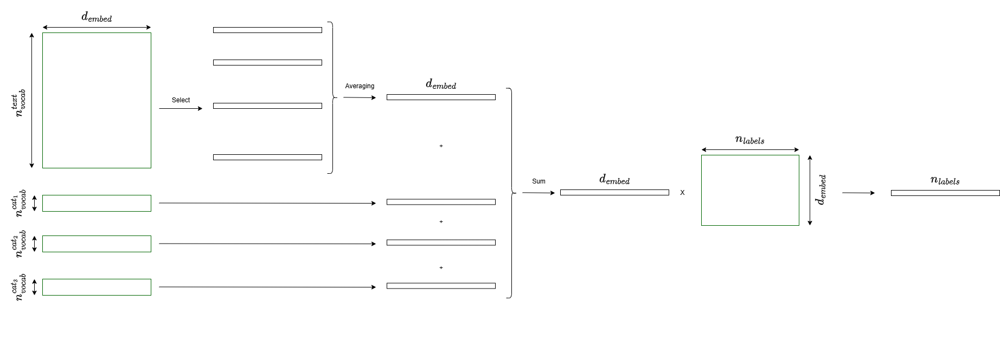
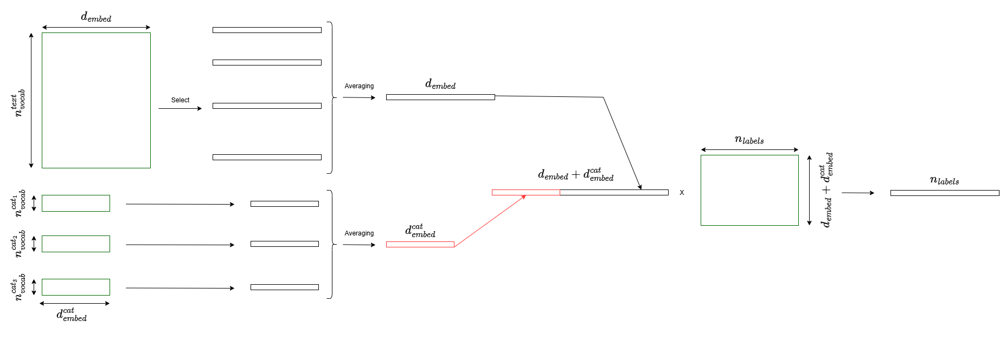
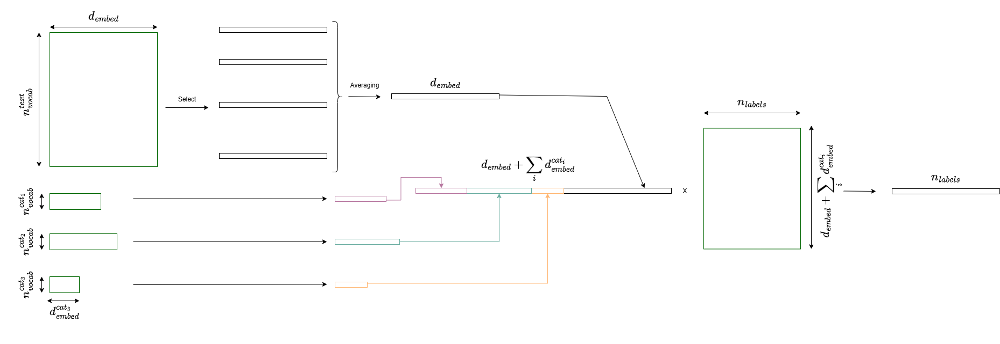

# torchFastText : Efficient text classification with PyTorch

A flexible PyTorch implementation of FastText for text classification with support for categorical features.

> **⚠️ This repository is no longer maintained.**
>
> It has evolved into a newer, actively maintained project: **torchTextClassifiers** - that aims at being a more general, unified framework and a toolkit for text classification in PyTorch.
>
> 👉 Please use the updated version here: [https://github.com/InseeFrLab/torchTextClassifiers](https://github.com/InseeFrLab/torchTextClassifiers)

## Features

* Supports text classification with FastText architecture
* Handles both text and categorical features
* N-gram tokenization
* Flexible optimizer and scheduler options
* GPU and CPU support
* Model checkpointing and early stopping
* Prediction and model explanation capabilities

## Installation

```bash
pip install torchFastText
```

## Key Components

* `build()`: Constructs the FastText model architecture
* `train()`: Trains the model with built-in callbacks and logging
* `predict()`: Generates class predictions
* `predict_and_explain()`: Provides predictions with feature attributions

## Subpackages

* `preprocess`: To preprocess text input, using `nltk` and `unidecode` libraries.
* `explainability`: Simple methods to visualize feature attributions at word and letter levels, using `captum` library.

Run `pip install torchFastText[preprocess]` or `pip install torchFastText[explainability]` to download these optional dependencies.

## Quick Start

```python
from torchFastText import torchFastText

# Initialize the model
model = torchFastText(
    num_tokens=1000000,
    embedding_dim=100,
    min_count=5,
    min_n=3,
    max_n=6,
    len_word_ngrams=True,
    sparse=True
)

# Train the model
model.train(
    X_train=train_data,
    y_train=train_labels,
    X_val=val_data,
    y_val=val_labels,
    num_epochs=10,
    batch_size=64,
    lr=4e-3
)
# Make predictions
predictions = model.predict(test_data)
```

where `train_data` is an array of size $(N,d)$, having the text in string format in the first column, the other columns containing tokenized categorical variables in `int` format.

Please make sure `y_train` contains at least one time each possible label.

## Dependencies

* PyTorch Lightning
* NumPy

## Categorical features

If any, each categorical feature $i$ is associated to an embedding matrix of size (number of unique values, embedding dimension) where the latter is a hyperparameter (`categorical_embedding_dims`) – chosen by the user – that can take three types of values:

* `None`: same embedding dimension as the token embedding matrix. The categorical embeddings are then summed to the sentence-level embedding (which itself is an averaging of the token embeddings). See Figure 1.
* `int`: the categorical embeddings have all the same embedding dimensions, they are averaged and the resulting vector is concatenated to the sentence-level embedding (the last linear layer has an adapted input size). See Figure 2.
* `list`: the categorical embeddings have different embedding dimensions, all of them are concatenated without aggregation to the sentence-level embedding (the last linear layer has an adapted input size). See Figure 3.

Default is `None`.


*Figure 1: The 'sum' architecture*


*Figure 2: The 'average and concatenate' architecture*


*Figure 3: The 'concatenate all' architecture*

## Documentation

For detailed usage and examples, please refer to the example notebook (`notebooks/example.ipynb`). Use `pip install -r requirements.txt` after cloning the repository to install the necessary dependencies (some are specific to the notebook).

## Contributing

Contributions are welcome! Please feel free to submit a Pull Request.

## License

MIT

## References

Inspired by the original FastText paper [1] and implementation.

[1] A. Joulin, E. Grave, P. Bojanowski, T. Mikolov, *Bag of Tricks for Efficient Text Classification*.
